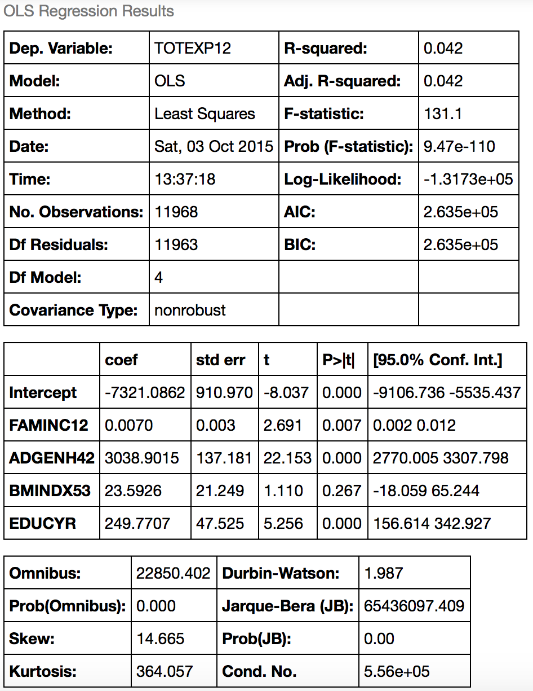
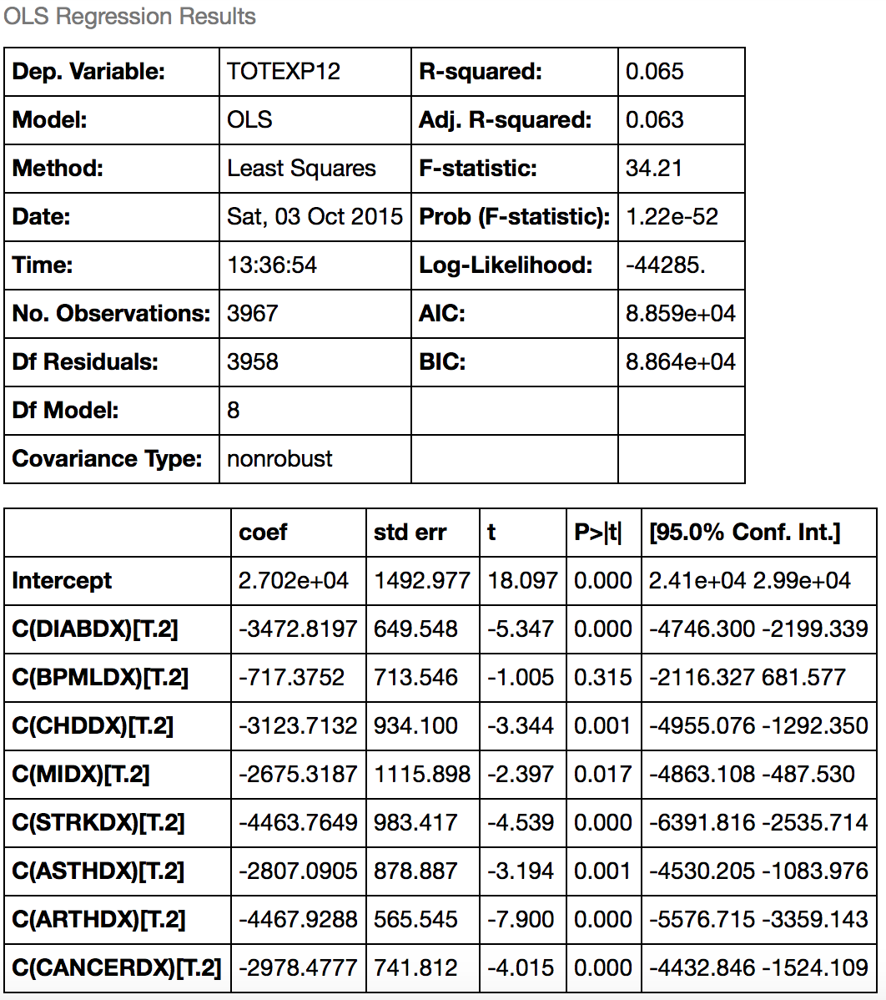
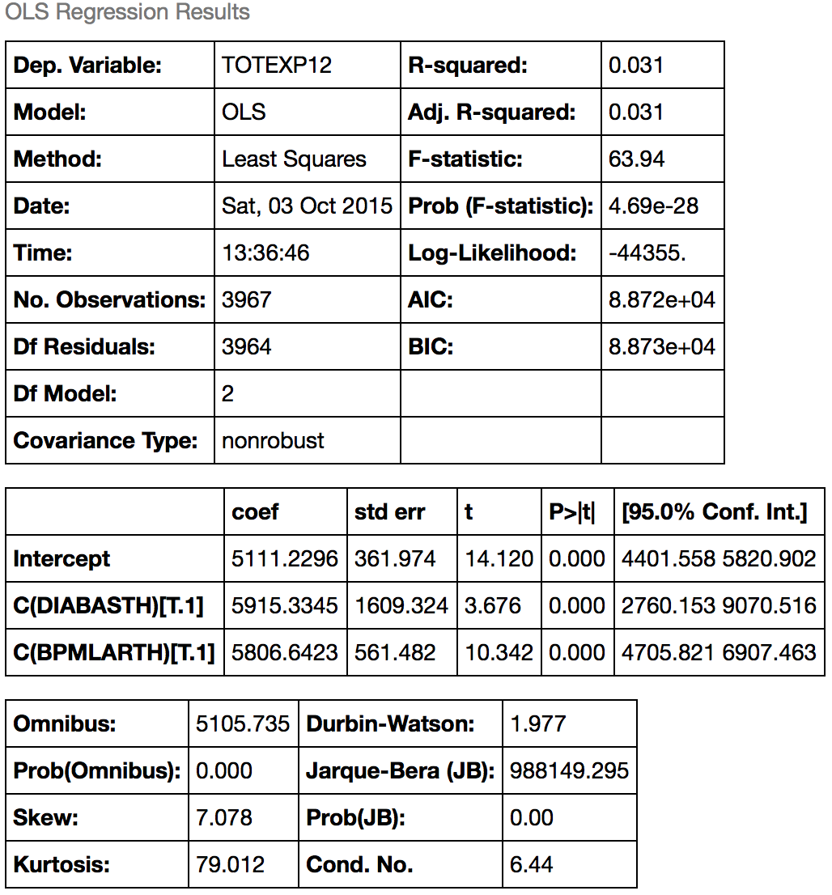
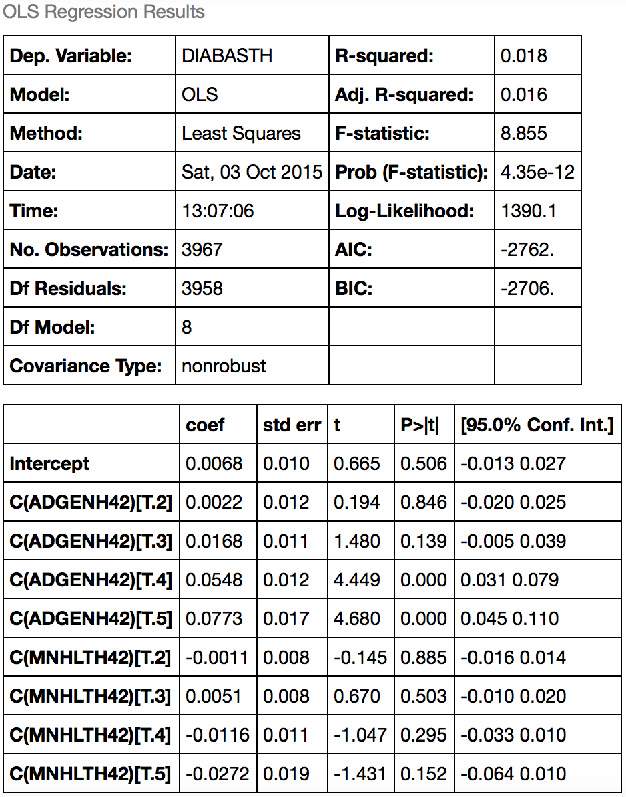
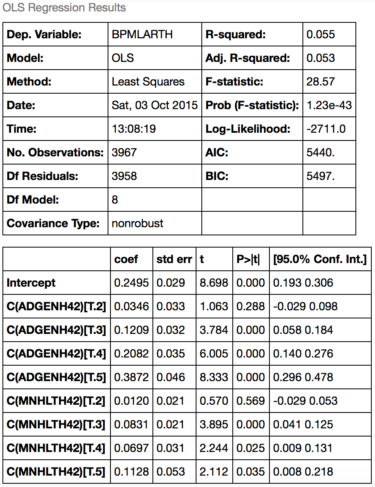

##CS 5555 Lab 2
###Tim Delisle and Sam Raudabaugh
### 2015-10-05
#### Summary
In this assignment, we familiarized ourselves with the Medical Expenditure Panel Survey (MEPS), an open dataset that offers information on patient spending and utilization as it relates to other properties including demographics and presence of comorbidities. We examinined interesting relationships and trends in the context of justifying a hypothetical EHR add-on.

#### Analysis
For simplicity, our approach was to look at a a subset of the data consisting of 37,000 individuals surveyed in 2012. This data file, 2012-Consolidated-stripped.csv, was retrieved from the CS 5555 GitHub site and imported into an IPython Notebook (attached) using the Pandas library.

With Pandas, we were able to easily prepare the data for regression models, using the query() function to discard rows that were missing values for the variables of interest. We used the StatsModels library to run ordinary least squares regression tests examining a number of variables, starting with total expenditure versus family income. 

<figure>
<figcaption>
Table 1: Expenditures vs income, BMI, education
</figcaption>
    
</figure>

The results in Table 1 show expenditures increasing slightly as family income increases, possibly due to confounding factors such as wealthier individuals paying more for their insurance.

<figure>
<figcaption>
Table 2: Expenditures vs general and mental health self-score
</figcaption>
    
</figure>

Next, we examined total expenditure versus a general health score self-reported by each individual. Table 2 shows an interesting trend where expenditure increases exponentially as you move up the 5-point scale, with a score of 5 representing the poorest general health.

<figure>
<figcaption>
Table 3: Expenditures vs individual chronic conditions
</figcaption>
    
</figure>

Finally, we created variables to represent combinations of chronic conditions in order to examine correlation between comorbidities and expenditures/score reports. Table 3 shows results with the chronic conditions separated while Tables 4, 5, and 6 show results with a couple of combinations of conditions.

<figure>
<figcaption>
Table 4: Expenditures vs diabetes and asthma, hypertension and arthritis
</figcaption>
    
</figure>

<figure>
<figcaption>
Table 5: Diabetes and asthma vs general and mental health self-score
</figcaption>
    
</figure>

<figure>
<figcaption>
Table 6: Hypertension and arthritis vs general and mental health self-score
</figcaption>
    
</figure>

#### Proposed EHR Add-on
Because the self-reported general health score was shown to have a dramatic correlation with expenditures, our proposed EHR add-on is a tool for patients to regularly submit such scores to their doctor. We feel that this would be especially useful for the adolescent and young adult demographics that typically have little interaction or communication with their doctors outside of infrequent visits. Hopefully this tool could help doctors sooner predict whether a patient's expenditures were at risk of becoming exponentially higher in the future.

#### Future Work
We would like to perform the same analysis on a larger sample of patients across multiple years.