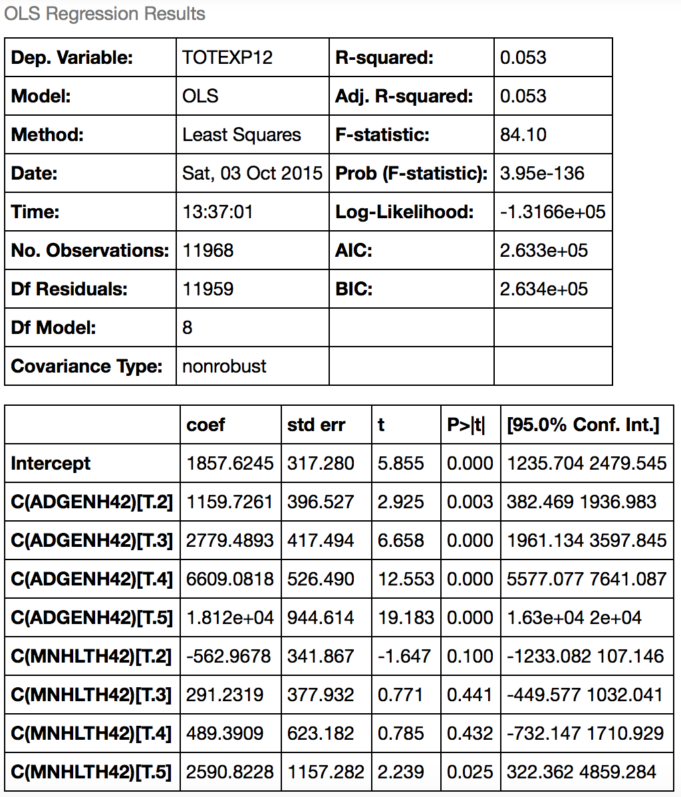

##CS 5555 Lab 2
###Tim Delisle and Sam Raudabaugh
### 2015-10-05
#### Summary
In this assignment, we familiarized ourselves with the Medical Expenditure Panel Survey (MEPS), an open dataset that offers information on patient spending and utilization as it relates to other properties including demographics and presence of comorbidities. We examined interesting relationships and trends in the context of justifying a hypothetical EHR add-on.

#### Proposed EHR add-on
Closing the feedback loop from patient to physician is becoming increasingly important outside the clinical setting. With engorged emergency rooms, a proclaimed shortage of primary care physicians and uncontrolled growth in medical expenditure it is becoming important to predict the risk of uncontrolled medical expenditure for patients. Understanding this risk would greatly benefit payers, providers, patients and regulators.

Our proposed EHR add-on is a tool for patients to regularly submit self reported health scores to their doctor. This tool would be in the form of a portal or app that is accessed by the patient to report their current health status. This portal could also potentially relay information to the patient's payer in order for the payer to incentivize the provider to take action on early predictors of increased spending.  

#### Analysis
For simplicity, our approach was to look at a a subset of the data consisting of 37,000 individuals surveyed in 2012. This data file, 2012-Consolidated-stripped.csv, was retrieved from the CS 5555 GitHub site and imported into an IPython Notebook (attached) using the Pandas library.

With Pandas, we were able to easily prepare the data for regression models, using the query() function to discard rows that were missing values for the variables of interest. We used the StatsModels library to run ordinary least squares regression tests examining a number of variables, starting with total expenditure versus family income.

<figure>
<figcaption>
Table 1: Expenditures vs income, BMI, education
</figcaption>
    
</figure>

The results in Table 1 show expenditures increasing slightly as family income increases, possibly due to confounding factors such as wealthier individuals paying more for their insurance.

<figure>
<figcaption>
Table 2: Expenditures vs general and mental health self-score
</figcaption>
    
</figure>

Next, we examined total expenditure versus a general health score self-reported by each individual. Table 2 shows an interesting trend where expenditure increases exponentially as you move up the 5-point scale, with a score of 5 representing the poorest general health.

<figure>
<figcaption>
Table 3: Expenditures vs individual chronic conditions
</figcaption>
    
</figure>

Finally, we created variables to represent combinations of chronic conditions in order to examine correlation between comorbidities and expenditures/score reports. Table 3 shows results with the chronic conditions separated while Tables 4, 5, and 6 show results with a couple of combinations of conditions. Though comorbidities result in drastically higher average health expenditure the data failed to show significant, interesting relationships between comorbitities and reported health.

<figure>
<figcaption>
Table 4: Expenditures vs diabetes and asthma, hypertension and arthritis
</figcaption>
    
</figure>

<figure>
<figcaption>
Table 5: Diabetes and asthma vs general and mental health self-score
</figcaption>
    
</figure>

<figure>
<figcaption>
Table 6: Hypertension and arthritis vs general and mental health self-score
</figcaption>
    
</figure>

#### Evidence for proposed EHR add-on
Because the self-reported general health score was shown to have a dramatic correlation with expenditures. We feel that our proposed add-on  would be especially useful for the adolescent and young adult demographics that typically have little interaction or communication with their doctors outside of infrequent visits. Hopefully this tool could help doctors sooner predict whether a patient's expenditures were at risk of becoming exponentially higher in the future.

#### Future Work
We would like to perform the same analysis on a larger sample of patients across multiple years. Longitudinal data would allow us to test if an increase decrease in mental or physical self reported health is a predictor of high expenditure i.e. does moving from average to poor physical health predict an increase in risk of moving from poor health to very poor health?
